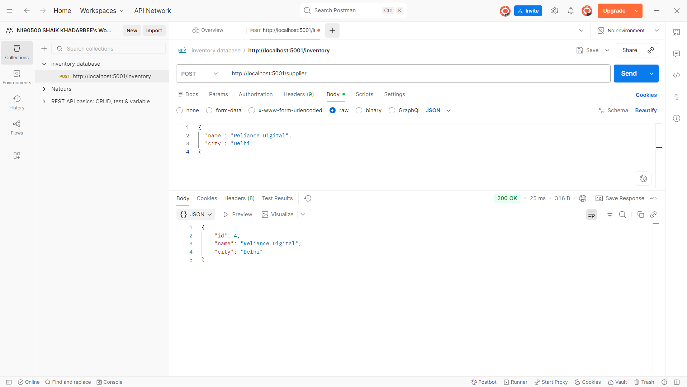
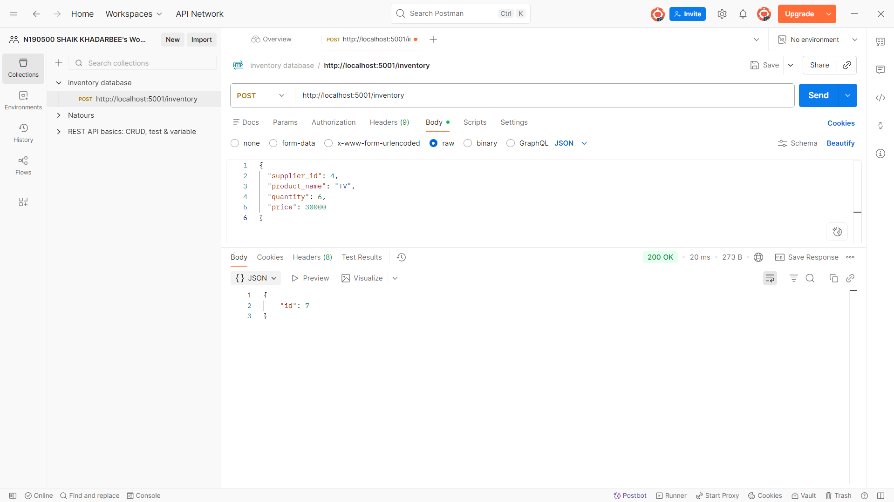
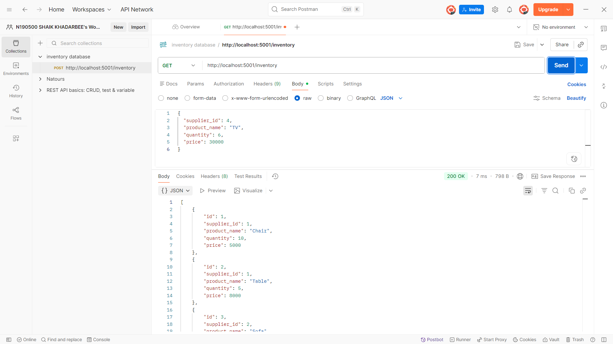
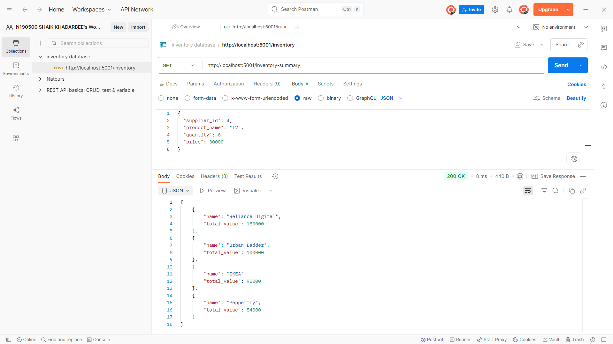
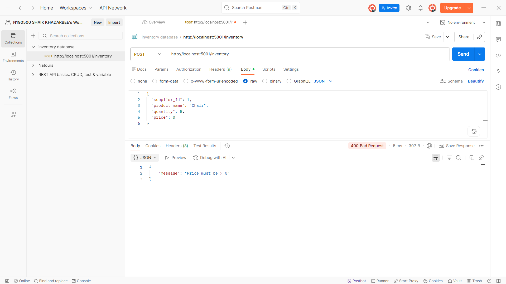

# 📦 Inventory Database API (Part B)
Backend:https://inventory-database-project-5.onrender.com

## API Endpoints

GET /inventory  
GET /inventory-summary  

Base URL:
https://inventory-database-project-5.onrender.com


## 🚀 Overview

This project implements a backend API for managing suppliers and their inventory. It allows creating suppliers, adding inventory items, and retrieving data including a grouped summary of total inventory value per supplier.

---

## 🛠 Tech Stack

* **Backend:** Node.js, Express.js
* **Database:** SQLite
* **API Testing:** Postman

---

## 🗄 Database Schema

### 1. Suppliers Table

* `id` (Primary Key, Auto Increment)
* `name`
* `city`

### 2. Inventory Table

* `id` (Primary Key, Auto Increment)
* `supplier_id` (Foreign Key → suppliers.id)
* `product_name`
* `quantity`
* `price`

### 🔗 Relationship

* One supplier can have multiple inventory items
* `supplier_id` in inventory links to `suppliers.id`

---

## 📡 API Endpoints

### ➤ Create Supplier

**POST /supplier**

```json
{
  "name": "IKEA",
  "city": "Hyderabad"
}
```

---

### ➤ Add Inventory

**POST /inventory**

```json
{
  "supplier_id": 1,
  "product_name": "Chair",
  "quantity": 10,
  "price": 5000
}
```

---

### ➤ Get All Inventory

**GET /inventory**

Returns all inventory records.

---

### ➤ Get Inventory Summary ⭐

**GET /inventory-summary**

Returns inventory grouped by supplier and sorted by total inventory value:

```json
[
  {
    "name": "IKEA",
    "total_value": 90000
  }
]
```

---

## ⚠️ Validations Implemented

* Inventory must belong to a **valid supplier**
* `quantity >= 0`
* `price > 0`

---

## 🧠 Why SQL (SQLite)?

SQLite was chosen because:

* Data is **relational (supplier → inventory)**
* Easy to use and setup
* Supports **joins and aggregation queries**

---

## ⚡ Optimization Suggestion

Adding an index on `supplier_id` can improve performance for:

* Join operations
* Filtering inventory by supplier

---

## ▶️ How to Run Locally

```bash
cd inventory-database-project
npm install
cd src
node server.js
```

Server runs on:

```text
http://localhost:5001
```

---

## 📸 Screenshots

### Create Supplier (POST /supplier)


### Add Inventory (POST /inventory)


### Get Inventory (GET /inventory)


### Inventory Summary (GET /inventory-summary)


### Invalid supplier


### invalid price

### invalid quantity


## 🎯 Features

* Supplier creation
* Inventory management
* Data validation
* Grouped summary query (total value per supplier)
* Clean and modular folder structure

---
